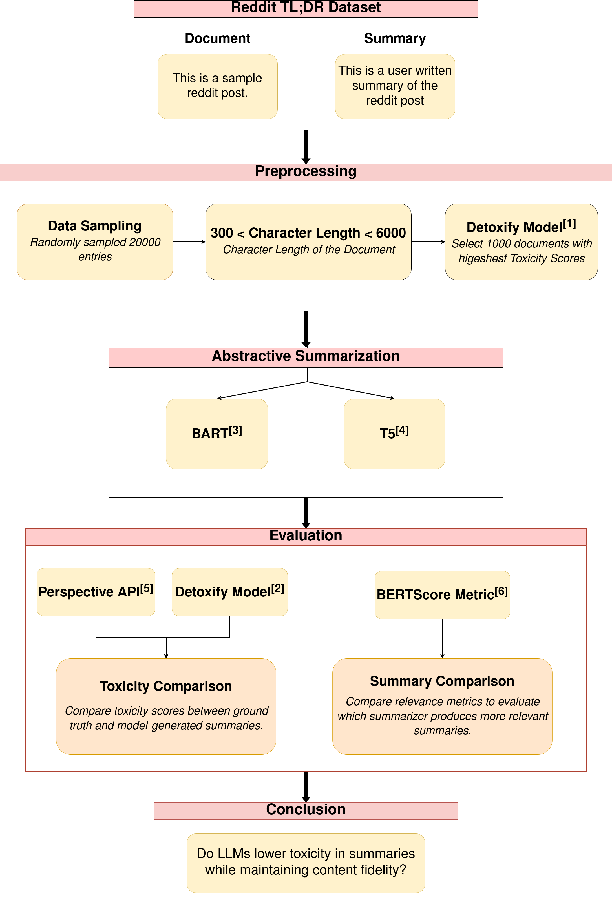

# Text-Summarisation-Eval

An evaluation framework for analyzing detoxification in text summarization models, focusing on how different LLM-based summarizers handle toxic content while maintaining semantic accuracy. This repo is part of the NLP course project taken in SoSe 2025 at Hochschule Bonn-Rhein-Sieg.

## Overview

This research explores how well LLMs suppress toxicity during summarization. Rather
than focusing on whether they introduce new toxicity, our emphasis is on whether they
can act as detoxifiers, reducing or removing toxicity present in the source document
while preserving meaning. This is critical for deploying LLMs in environments such as
media monitoring, social platforms, and customer feedback analysis.

## Key Findings

- LLM summarization models demonstrate natural detoxification capabilities while preserving essential information
- BART achieves optimal balance between content safety and semantic accuracy.
- Shorter texts exhibit higher toxicity levels in both source documents and reference summaries.
- Model-generated summaries sometimes surpass human-written references in quality metrics.

## Dataset

- Initial dataset: 3 million documents
- Subsampled dataset: 20,000 documents
- Refined dataset: 1,000 most toxic documents
- Document length: 300-6,000 characters
**Toxicity Distribution Statistics**

| Dataset            | Metric         | Document Toxicity | Summary Toxicity | Document Length | Summary Length |
|--------------------|---------------|------------------|------------------|----------------|---------------|
| **Initial**        | Median        | 0.004            | 0.003            | 1025.0         | 98.0          |
|                    | Mean          | 0.101            | 0.160            | 1477.4         | 143.5            |
| **Refined**        | Median        | 0.850            | 0.402            | 899.5          | 83.0          |
|                    | Mean          | 0.846            | 0.470            | 1275.8         | 116.9            |

- *Document/summary toxicity* values are on a 0–1 scale.
- *Document/summary length* is measured in characters.
## Models Evaluated

- BART (token limit: 1,024)
- T5 (token limit: 512)
- Document chunking implemented for longer texts

## Project Structure

```
project/
├── data/           # Dataset and results
├── evaluation/     # Evaluation metrics implementation
├── summarizers/    # Model implementations
└── visualization/  # Visualization tools
```

## Setup

1. Clone the repository:
```bash
git clone https://github.com/username/Text-Summarisation-Eval.git
cd Text-Summarisation-Eval
```

2. Install dependencies:
```bash
pip install -r project/requirements.txt
```

## Architecture




## Evaluation Metrics

- BERTScore: Semantic similarity measurement
- Toxicity metrics: Using Detoxify + Perspective API
- ROUGE scores: Summary quality evaluation

## Deliverables

- Proposal: proposal/NLP_Project_Proposal.pdf
- Poster : Toxicity_Summarisation_eval_Poster.pdf

